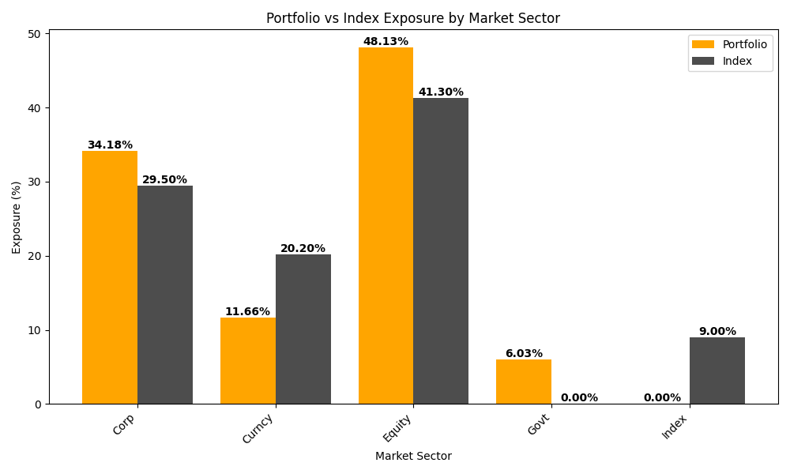

# Portfolio vs Index Exposure Analysis 

## Overview
This project compares **Portfolio Exposure** vs **Index Exposure** across different Market Sectors.  
It uses **Python (Pandas, Matplotlib, NumPy)** to process and visualize financial data.

---

## Code Output

Sector Comparison:
  Market Sector Portfolio_Exposure Index_Exposure Difference
0          Corp             34.18%         29.50%      4.68%
1        Curncy             11.66%         20.20%     -8.54%
2        Equity             48.13%         41.30%      6.83%
3          Govt              6.03%          0.00%      6.03%
4         Index              0.00%          9.00%     -9.00%

Summary of Notable Differences

 Portfolio is Overweight in:
  - Corp (+4.68%)
  - Equity (+6.83%)
  - Govt (+6.03%)

 Portfolio is Underweight in:
  - Curncy (-8.54%)
  - Index (-9.00%)

---

## Portfolio vs Index Exposure Chart


---

## Project Structure

---

## How to Run
1. Clone the repository:
   ```bash
   git clone https://github.com/csrfnc/JA-Interview-Test.git
